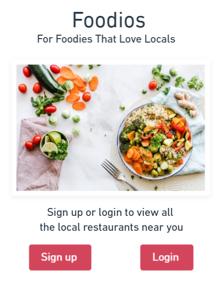
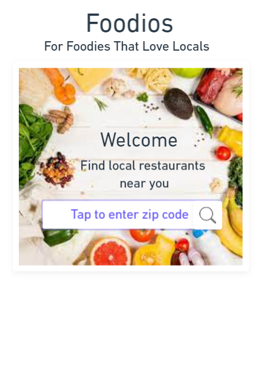
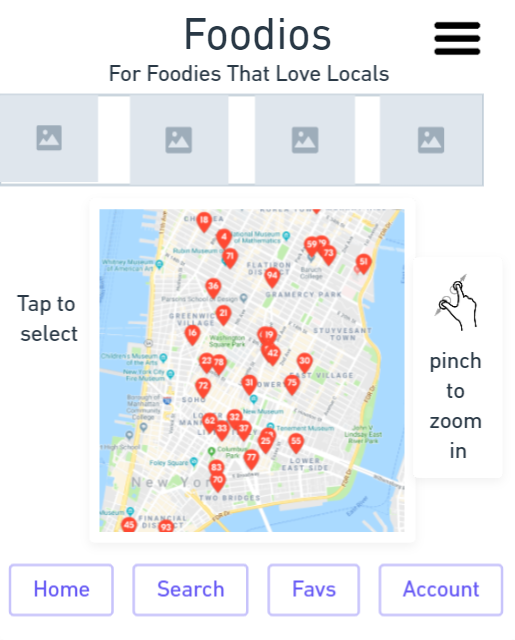

# wendy-food project1

Food app project that specialize in local eateries. User can 
create account, earn points, find local eateries using Google map near them. Add local eateries and food reviews by users

step 1: create basic layout with pictures of food from local eatery.

step 2: Search local eateries nearby

step 3: Let user create account for specials/points

Step 4: Add videos of food history and culture

### Foodios

#### Product Description
Food app project that specialize in local eateries. User can 
create account, earn points, find local eateries using Google map near them. 
Add local eateries and food reviews by the users. 

#### Major Goals
1. Search bar for user to find their favorite cuisines.
2. Zip code search for local eateries
3. Drop down menu for different local cuisines.
4. Videos and images uploaded by the users that have been to the local eateries and share
    their review/experience

5. Database to keep track of user's account

#### Stretch Goals
1. Allow user to add their credit card and buy e-Giftcard to send to friends
2. Add traveling info for users to learn about the origin of food and cultures
3. Social media share feed
4. Earn points for discounts

### Functional Requirement
#### use Cases
1. Jane just move to the area, and she heard about this app from her local bank teller.
Jane loves food and love to eat out and try local restaurants and this app specializes in local
restaurants. Upon browsing on the app, it prompts her on her zipcode. Once she enters,
the google map pin points locations of local restaurants near where she lives. On the top of the map
it shows where people share their reviews and photos of the food. Jane can tap on the image,
the screen zoom in and show all the slide of food images. She can choose to fork-it as a way to save
that restaurant for her next dine out. She can exit the image slides by tapping the close tab. Pop up features will ask
Jane if she likes to sign up to earn points. More points mean more discounts for her dine out.
Every time she shares on social media, she earns points.

### Non-functional Requirement
Scalability
- This is a mobile and web application, it needs to handle large volume. Am considering 
using serverless and cloud for storage. 
- Since we need to store user account and possible credit card. For ease of use, we'll use third 
party login such as google or facebook. For payment, users can choose Paypal or Stripe. 

Usability
- Target foodie or anyone who's looking for local restaurants.

### Software Architecture
Wireframe for the homepage of Foodio

Wireframe for search page by zipcode

Wireframe for result page with google map

#### Major Components and Functionalities

#### Frontend Structure:
Use React Native

#### Backend Structure:
Firebase
